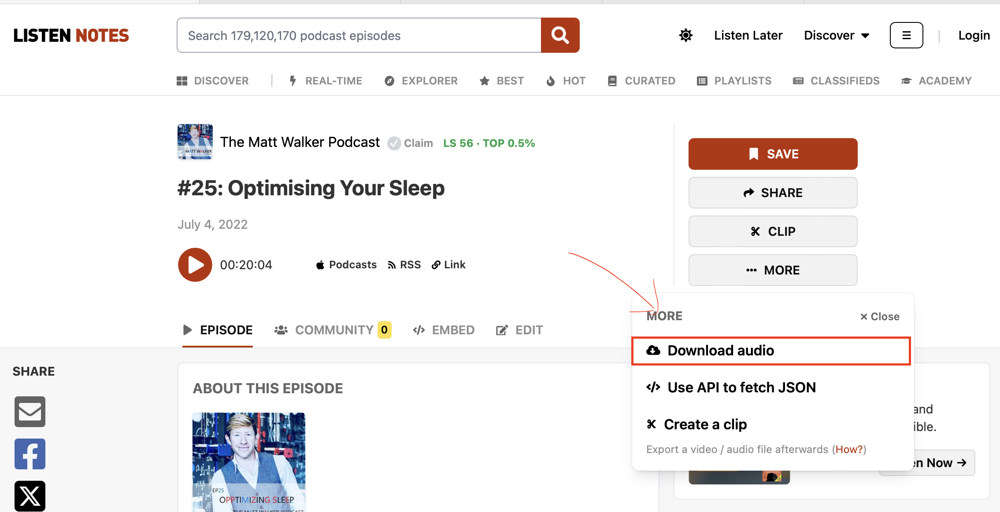
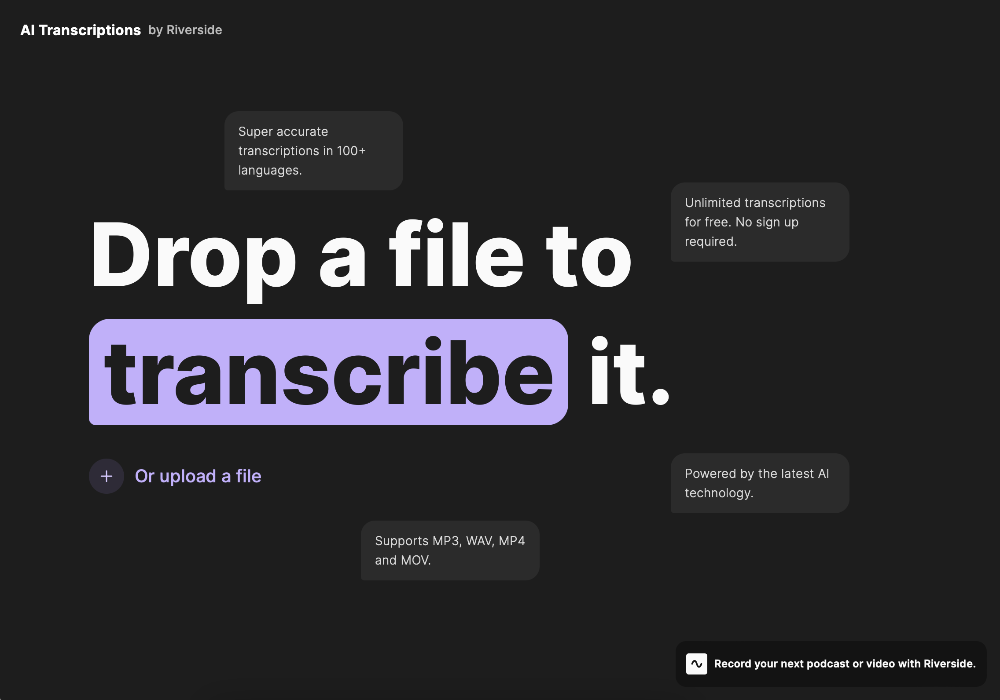
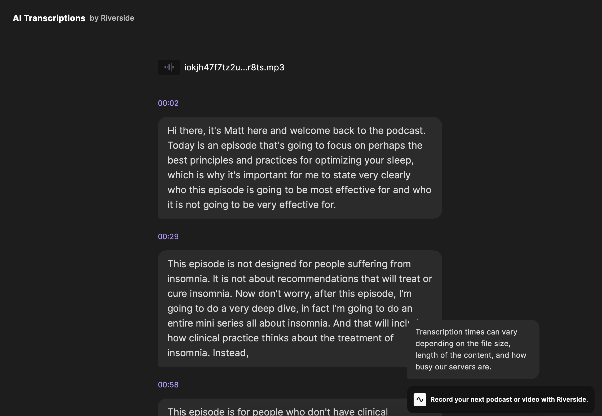
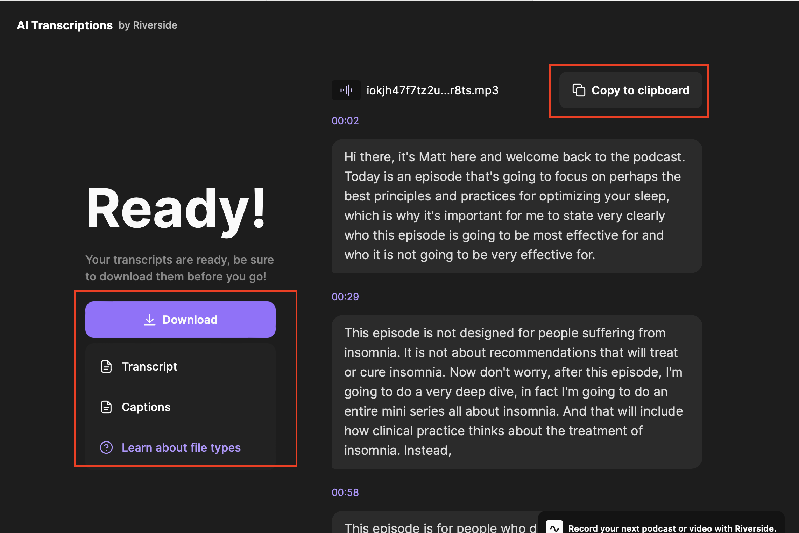
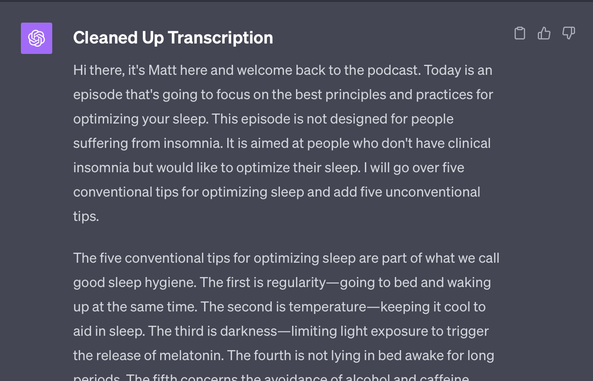
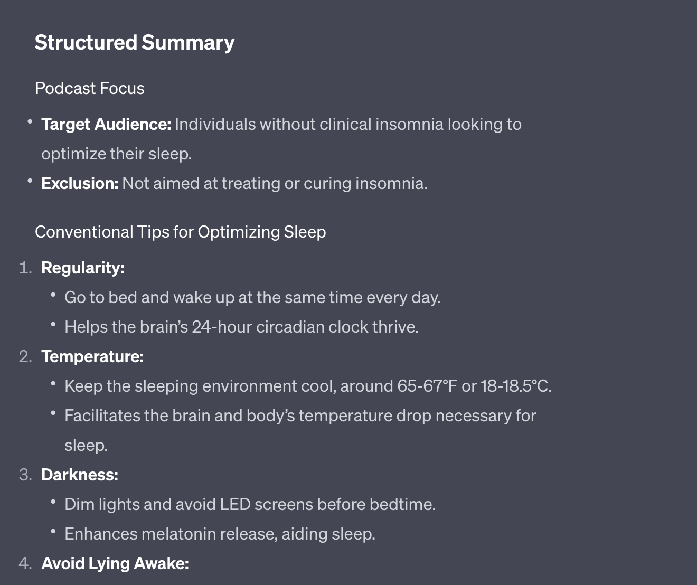
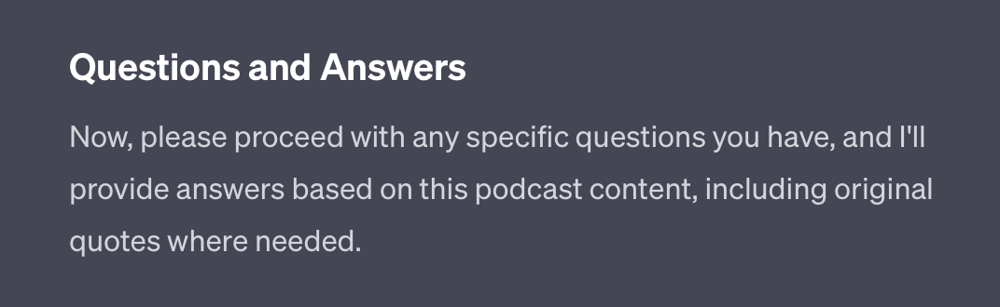
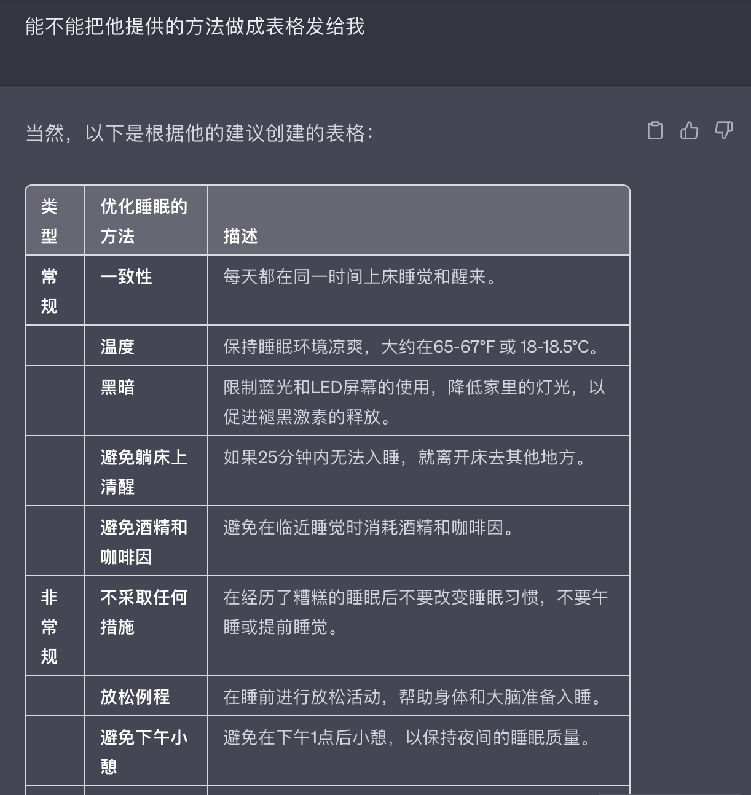

## 背景
在整理一篇有关OSA（呼吸睡眠暂停综合征）和癫痫的综述的时候，恰好听到美国睡眠协会的一期播客，讲的是OSA和心血管疾病的七七八八。听过一遍之后觉得需要检索的点很多，就边听边记笔记 --- 十分钟的内容反复听过之后得花上二十分钟记笔记、检索，效率实在太低。

引申到自己听播客这么多年，总有那么几期觉得听过之后意犹未尽，想进一步学习 -- 重复听，记笔记，拓展学习阅读等等。但听播客的时候一般都在路上，或者在做饭，洗澡，很难做到专门给播客腾出一段时间坐下来听。一方面是注意力很难集中，另一方面就是自己太懒。

在研究过几种方法（比如电脑放播客，手机用app转录）后，找到了一个超级（真的吗？）方便且适用于学习一切语音材料的方法。

## 工具
三个免费工具：
1. [Lisen Notes](https://www.listennotes.com)
2. [RiversideFM Transcript](https://riverside.fm/transcription)
3. [ChatGPT](http://chat.openai.com)

## 流程
1. Listen Notes去下载播客的源文件
2. 上传到RiversideFM进行文字转录
3. 送去ChatGPT
	4. 总结播客内容
	5. 和播客内容进行对话🌟

## 举例
在尝试过几个不同的播客之后，我发现这种方法最适用的还是英文播客。我在这里用一期Mathew Walker的播客举例。

先去Lisen Notes找到打算精听的那期播客：

下载语音文件，然后去RiversideFM：

在这里看到这个网站目前提供免费转录几乎所有类型的语音、视频文件。

下一步，把语音文件丢进去。在转录过程中它会实时显示转录的内容。取决于文件大小、播客时长，处理时间可长可短:

转录完成后可以选择复制文档到剪贴板，或者下载转录文档，网站提供了txt和srt（字幕）两种不同格式：

接下来我们转去ChatGPT。其实写到这里我发现这几个工具转来转去还是怪麻烦的，如果有编程背景，这套步骤完全可以自动化……

因为我有购买GPT4（GPT4可以处理更多文字，我bias认为GPT4提供更好的输出），故以下都是用GPT4举例：

这是我用在ChatGPT的prompt：
> You are my Podcast assistant. I will give you a transcription from a Podcast. You will: 
> 1. Clean up the transcription, remove the time stamp; 整理文字，去掉时间标记
> 2. Summarize the content, provide me with a structured output： 总结播客内容并提供大纲
> 3. I will ask questions, then you will give me answers based on the content of the podcast, you will provide an original quote from the transcription when you provide answers； 我接下来会向你提问，我需要你在回答问题的时候同时提供播客内的原文做参考
> 4. Let me know when you're ready. 准备进行下一步。

**首先整理文字**：

**其次总结并提供大纲**：

**准备接受提问**：

ChatGPT最厉害的地方是“无语言限制”：你可以用中文跟英文内容进行互动，根本上消除了因为语言水平不足造成的壁垒：

举例完毕，以上就是用三个工具（怪繁琐的其实……）实现跟播客互动学习的方法。

展望：希望有心人能出一个（免费的）一站式解决工具。

