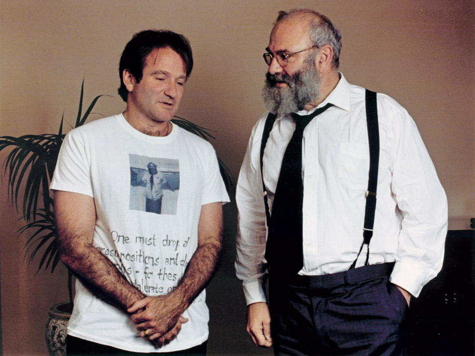

<!--more-->

## 写在前面

医学，具体点说医学实践，是一门将科学，人文，艺术，经济，政治综合在一起的一个行当。不过从医学院，到住院医，甚至正式执业之后，我们的“必读书目”似乎只有“科学”这一推荐分类。大学里面也仅有一门课：医学人文，会蜻蜓点水带我们了解一点医学史，一点医学人文故事。剩下的？那就得靠我们自己在实践中去悟了。

我们眼里的医学是一门科学，就像象牙塔里面的所有知识，纯粹，但是社会上的医学实践却不是，它是花姑娘，它对人文素养的要求，它创造的巨大的经济价值，它孕育的艺术作品，它被政策左右和左右政策，并不会因我们视而不见而消失。

我们被这种“医学是科学”的天真想法教育了数年，进入社会才发现，治病救人不是门诊开药手术那么简单，心理准备的欠缺，现实与理想之间的不平衡，职业倦怠的出现也就不可避免了。

医生的职业倦怠率（burn out）非常高，据统计，在美国42%的医生反应有职业倦怠的情况，其中15%被诊断抑郁症或存在抑郁症状。住院医期间，每周动辄80～100小时的工作，每天上班处理不完的临床任务，逐渐把“治病救人”变成了一项机械性的活动。执业一段时间之后，医学实践就变成了日常工作，朝九晚五。从正在接受住院医培训的小伙伴的朋友圈也能初见端倪，比如迷茫的，比如找不到职业目标的。正在执业的医生说不想再听病人唠叨的。职业倦怠问题如果不主动应对，轻则抑郁，转行，放弃行医，重则……那就不知道了。

作为医生，我们拥有的一项特权就是在工作当中无数次的直面死亡，如何避免让自己麻木，如何保持对死亡的敬畏，保持对患者的关怀，这些都是需要思考的问题。

现代医学通过美国发扬光大，光环下面的问题当然也层出不穷，比如抓破头也想不明白怎么改善的医疗系统，能在2年内就让42%的患者倾家荡产的医疗花费，以及如化石一般百年未变的医学教育。

因此以医学为主题的英文书也反映了美国医学包罗万象的特点。下面这份书单是在美执业的医生推荐给其他医生的读物（来自twitter的一份合集），涵盖科学，人文，经济，政策等等，很多书的Goodread和Amazon评价都是“每一位医疗工作者都应该阅读”，或者“医学院应该将这本书作为必读书目”。一共44本，都是英文，个别有中译本我都附上了豆瓣链接。很幸运的是，我今年住院医面试的第一个项目，送给每位面试者一本「In Shock」，我在Twitter合集里面看到很多人提到这本书，看来是不可以错过的。

通过他人的经验，文字，想法，引导自己思考，总结，沉淀不失一种好方法。当然也推荐给非医疗工作者，希望这里面的一些书能帮助我们在这个混沌的系统里面为自己，为家人找到一个落脚点。

欢迎各位把自己看过的，认为是医生就应该读的书分享给我，希望这个书单可以一直更新下去。梦想是整理一份超级全的医学书单，并把这些书都整整齐齐的码在书架上，然后一本一本在书脊上贴上“已读”的标签。

题图里是两位最喜欢的“人”。一位是最喜欢的演员，Robbin Williams，最后因Lewy Body Dementia去世。一位是Oliver Sacks，神经内科医生，作家，诗人。Robbin Williams曾在电影版的Awakenings里面饰演Oliver Sacks，记得这部电影是我考Step1前一晚看的，给自己鼓劲儿：记得你明天去考的试，就是为了未来能成为这样的医生走的第一步。

## 医生是什么

1. Hot lights, Cold steel: Life, Death and Sleepless Nights in a Surgeon’s First Years by Dr. Michael J. Collins [《梅奥住院医生成长手记》](https://book.douban.com/subject/26759891/)
2. The Laws of Medicine by Siddhartha Mukherjee[《医学的真相》](https://book.douban.com/subject/26844088/)
3. The Man Who Mistook His Wife For A Hat by Oliver Sacks[《错把妻子当帽子》](https://book.douban.com/subject/4742971/)
4. When the Air Hits your Brain by Frank Vertosick[《神经外科的黑色喜剧》](https://book.douban.com/subject/1852700/)
5. What Doctors Feel: How Emotions Affect the Practice of Medicine by Danielle Ofri 
6. How doctors think by Jerome E. Groopman
7. This is Going to Hurt: Secret Diaries of a Junior Doctor by Adam Kay
8. The House of God by Samuel Shem, Sean Runnette, et al.

## 生与死

1. Man’s Search for Meaning by Viktor E. Frankl , Harold S. Kushner, et al.[《活出生命的意义》](https://book.douban.com/subject/5330333/)
2. Do No Harm: Stories of Life, Death, and Brain Surgery by Henry Marsh [《医生的抉择》](https://book.douban.com/subject/27059494/)
3. Being Mortal by Atul Gawande[《最好的告别》](https://book.douban.com/subject/26576861/)
4. When breath becomes the air by Paul Kalanithi[《当呼吸化为空气》](https://book.douban.com/subject/26896859/)
5. With the End in Mind: Dying, Death, and Wisdom in an Age of Denial by Kathryn Mannix, Elizabeth Carling, et al.
6. Extreme Measures: Finding a Better Path to the End of Life by Jessica Nutik Zitter M.D.
7. In Shock: My Journey from Death to Recovery and the Redemptive Power of Hope by Rana Awdish

## 不忘初心

1. The Illness Narratives: Suffering, Healing, And The Human Condition by Arthur Kleinman[《疾痛的故事》](https://book.douban.com/subject/27609306/)
2. Better By Atul Gawande[《医生的精进》](https://book.douban.com/subject/26578141/)
3. The Lost Art of Healing: Practicing Compassion in Medicine by Bernard Lown
4. The Anatomy of Hope: How People Prevail in the Face of Illness by Jerome Groopman M.D., Paul Michael, et al.
5. Every Patient Tells a Story: Medical Mysteries and the Art of Diagnosis by Lisa Sanders

## 医疗决策

1. The Checklist Manifesto by Atul Gawande[《清单革命》](https://book.douban.com/subject/10788371/)
2. Thinking, Fast and Slow by Daniel Kahneman [《思考，快与慢》](https://book.douban.com/subject/10785583/)
3. Organized Mind by Daniel J. Levitin, Luke Daniels, et al.[《有序》](https://book.douban.com/subject/30205294/)
4. Nudge by Richard Thaler[《助推》](https://book.douban.com/subject/4022709/)
5. Factfullness by Hans Rosling
6. Doing Harm by Maya Dusenbery 
7. Getting Risk Right by Geoffrey Kabat
8. Ending Medical Reversal by Adam Cifu and Vinay Prasad

## 医学史

1. The Nazi Doctors by Robert Jay Lifton[《纳粹医生》](https://book.douban.com/subject/26865732/)
2. The Gene by Siddhartha Mukherjee[《基因传》](https://book.douban.com/subject/27168433/)
3. The Emperor of All Maladies by Siddhartha Mukherjee[《众病之王》](https://book.douban.com/subject/20507206/)
4. The Philadelphia Chromosome: A Mutant Gene and the Quest to Cure Cancer at the Genetic Level by Jessica Wapner, Heather Henderson, et al.
5. The Butchering Art: Joseph Lister’s Quest to Transform the Grisly World of Victorian Medicine by Lindsey Fitzharris 
6. Medical Detectives by Berton Roueche
7. The discovery of Insulin Michael Bliss 
8. Polio wars by Naomi Rogers

## 科普向

1. The Structure of Scientific Revolutions by Thomas S. Kuhn, Dennis Holland, et al.[《科学革命的结构》](https://book.douban.com/subject/1123740/)
2. Lies My Doctor Told Me: Medical Myths That Can Harm Your Health Ken D. Berry MD
3. A Brief History of Everyone Who Ever Lived by Adam Rutherford[《我们人类的基因》](https://book.douban.com/subject/27084491/)
4. Sapiens by Yuval Noah Harari[《人类简史》](https://book.douban.com/subject/26953606/)
5. 21 lessons for the 21st Century by Yuval Noah Harari[《今日简史》](https://book.douban.com/subject/30259720/)
6. Do you Believe in Magic - The sense and nonsense of alternative medicine by Paul A. Offit M.D.
7. The End of Alzheimer’s: The First Program to Prevent and Reverse Cognitive Decline by Dale Bredesen

## 美国拥有发达国家中最糟糕的医疗系统

1. America’s Bitter Pill: Money, Politics, Backroom Deals, and the Fight to Fix Our Broken Healthcare System by Steven Brill 
2. Overdiagnosed: Making People Sick in the Pursuit of Health by H. Gilbert Welch
3. The Question of Competence: Reconsidering Medical Education in the Twenty-First Century (The Culture and Politics of Health Care Work) by Brian D. Hodges, Lorelei Lingard, et al.
4. An American Sickness: How Healthcare Became Big Business and How You Can Take It Back by Elisabeth Rosenthal 
5. Why we revolt: A patient revolution for careful and kind care by Victor Montori
6. The Social Transformation of American Medicine: The Rise Of A Sovereign Profession And The Making Of A Vast Industry by Paul Starr, Sean Runnette, et al.
7. Overtreated: Why Too Much Medicine Is Making Us Sicker and Poorer by Shannon Brownlee 
8. The American Health Care Paradox: Why Spending More Is Getting Us Less by Elizabeth H. Bradley, Lauren A. Taylor, et al.
9. The Healing of America: A Global Quest for Better, Cheaper, and Fairer Health Care by T. R. Reid 

## 行为科学，小说和其他

1. Switch: How to Change Things When Change Is Hard by  Chip & Dan Heath[《瞬变》](https://book.douban.com/subject/5336008/)
2. Cutting for Stone: A Novel by Abraham Verghese, Sunil Malhotra, et al.[《斯通，与另一个斯通》](https://book.douban.com/subject/20428300/)
3. Awakenings by Oliver Sacks[《睡人》](https://book.douban.com/subject/6114839/)
4. An Anthropologist on Mars by Oliver Sacks[《火星上的人类学家》](https://book.douban.com/subject/4821765/)
5. Oliver Sacks的任何一本书([奥利弗·萨克斯](https://book.douban.com/author/302568/))
6. Everything Happens for a Reason: And Other Lies I’ve Loved by Kate Bowler
